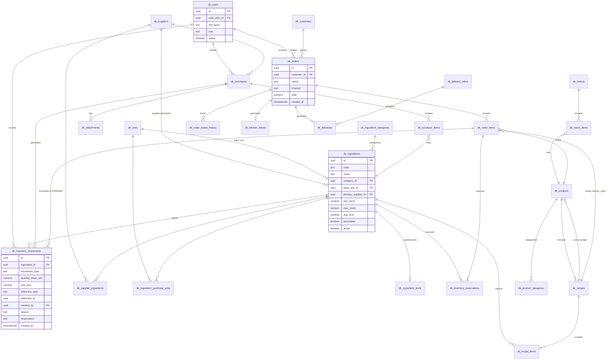

# Database ERD — Dark Kitchen (prefijo `dk_`)

## Diagrama (mermaid)



> El diagrama omite algunas columnas por brevedad; el detalle completo de cada tabla está abajo.

---

## Lista completa de tablas

### Identidad / RBAC
- `dk_users` — perfil de staff, 1:1 con `auth.users`; `avatar_key` = uno de los 20 avatares de personas (ADR 0009)
- `dk_audit_log` — auditoría genérica (tabla, registro, acción, valores antes/después, usuario, fecha)

### Organizaciones, Cuentas y funciones (ADR 0008 y 0009)
- `dk_organizations` — el negocio; `owner_user_id` = SUPER_ADMIN (creador, intransferible)
- `dk_organization_members` — usuario ↔ organización (SUPER_ADMIN o Miembro; activo/pendiente/desactivado)
- `dk_kitchens` — la **Cuenta** (establecimiento); `icon_key` = uno de los 20 iconos de establecimiento
- `dk_kitchen_members` / `dk_member_roles` — usuario ↔ Cuenta, con varios roles y uno predeterminado
- `dk_roles` / `dk_role_permissions` / `dk_permissions` — RBAC: plantillas, roles propios y catálogo de permisos
- `dk_features` — catálogo de funciones opcionales (IA, voz): permiso para usarla y para activarla, valores por defecto
- `dk_organization_features` — qué funciones ofrece cada organización (sin fila = valor del catálogo)
- `dk_kitchen_features` — qué funciones activa cada Cuenta y sus parámetros (antes `dk_ai_features`; queda una vista de compatibilidad con ese nombre)
- `dk_ai_insights` — análisis de IA (append-only), por Cuenta y función

### Catálogos base
- `dk_units` — unidades de medida y su factor de conversión a la unidad base de su tipo
- `dk_ingredient_categories`
- `dk_product_categories`

### Insumos e inventario
- `dk_ingredients`
- `dk_ingredient_purchase_units` — empaques de compra específicos por insumo (caja, bolsa, etc.)
- `dk_ingredient_stock` — **caché** de stock actual/reservado/disponible por insumo (derivable 100% del ledger)
- `dk_inventory_movements` — **ledger**, append-only (COMPRA, MERMA, AJUSTE, CONSUMO, DEVOLUCION)
- `dk_inventory_reservations` — reservas activas ligadas a `order_items`

### Proveedores y compras
- `dk_suppliers`
- `dk_supplier_ingredients` — qué insumos compramos a cada proveedor (+ costo pactado opcional)
- `dk_purchases` — factura de compra (cabecera)
- `dk_purchase_items` — líneas de la factura
- `dk_attachments` — archivos genéricos en Storage (facturas escaneadas, fotos), referenciables desde cualquier entidad (`entity_type` + `entity_id`)

### Recetas y productos
- `dk_recipes` — versionado (`product_id`, `version`, `is_active`)
- `dk_recipe_items` — ingredientes de una versión de receta
- `dk_products` — el plato vendible (referencia `active_recipe_id`)

### Menú
- `dk_menus`
- `dk_menu_items` — disponibilidad/precio especial de un producto dentro de un menú/fecha

### Clientes y pedidos
- `dk_customers`
- `dk_orders`
- `dk_order_items`
- `dk_order_status_history` — auditoría de transición de estados del pedido

### Cocina
- `dk_kitchen_tickets` — comanda (snapshot 1:1 con `dk_orders` al confirmar)

### Despacho / domicilios
- `dk_delivery_riders`
- `dk_deliveries` — 1:1 con `dk_orders`, asignación de domiciliario + timestamps

### Reservado para Fase 9 (no se crea aún)
- `dk_whatsapp_conversations`, `dk_whatsapp_messages` — se diseñan cuando llegue la fase; hoy solo se reservan columnas (`dk_orders.channel`, `dk_orders.external_reference`, `dk_customers.whatsapp_id`).

---

## Enums propuestos

```sql
create type dk_role as enum ('ADMIN','MANAGER','KITCHEN','INVENTORY','CASHIER','DELIVERY');

create type dk_unit_type as enum ('WEIGHT','VOLUME','UNIT');

create type dk_movement_type as enum ('COMPRA','MERMA','AJUSTE','CONSUMO','DEVOLUCION');

create type dk_reservation_status as enum ('ACTIVE','RELEASED','CONSUMED');

create type dk_purchase_status as enum ('BORRADOR','CONFIRMADA','ANULADA');

create type dk_order_status as enum ('NUEVO','CONFIRMADO','EN_PREPARACION','LISTO','DESPACHADO','ENTREGADO','CANCELADO');

create type dk_order_channel as enum ('MANUAL','WHATSAPP','PHONE');

create type dk_kitchen_item_status as enum ('PENDIENTE','EN_PREPARACION','LISTO');

create type dk_delivery_status as enum ('ASIGNADO','EN_RUTA','ENTREGADO','FALLIDO');
```

## Claves, índices y constraints notables

- `dk_inventory_movements`: **sin** política de `UPDATE`/`DELETE` para ningún rol (ni ADMIN) — solo `INSERT`. Índice compuesto `(ingredient_id, created_at)` para reconstrucción/reportes. `quantity_base_unit` puede ser negativo (salida) o positivo (entrada); `movement_type` determina el signo esperado (constraint `CHECK`).
- `dk_ingredient_stock`: `UNIQUE(ingredient_id)`, mantenida solo por trigger (no editable directo por el cliente).
- `dk_recipes`: `UNIQUE(product_id, version)`; solo una fila con `is_active = true` por `product_id` (constraint parcial `UNIQUE(product_id) WHERE is_active`).
- `dk_purchases`: `UNIQUE(supplier_id, invoice_number)` para evitar duplicar una factura.
- `dk_order_items.recipe_id`: `NOT NULL` una vez el pedido pasa de `NUEVO` (se congela la receta al confirmar) — validado en el RPC, no como constraint de columna, porque en `NUEVO` puede ser null si el producto aún no tiene receta activa forzada.
- `dk_customers.whatsapp_id`: `UNIQUE`, nullable.
- Todas las tablas: `created_at timestamptz default now()`, y donde aplica `updated_at` mantenido por trigger genérico `dk_set_updated_at()`.

## Triggers necesarios

1. `dk_trg_movements_update_stock` — `AFTER INSERT` en `dk_inventory_movements` → recalcula/actualiza `dk_ingredient_stock`.
2. `dk_trg_recipe_cost_recalc` — `AFTER INSERT/UPDATE` en `dk_recipe_items` o cambio de `avg_cost` en `dk_ingredients` → recalcula `dk_products.estimated_cost` de los productos afectados.
3. `dk_trg_set_updated_at` — genérico, en todas las tablas mutables.
4. `dk_trg_audit_*` — en tablas sensibles (`dk_ingredients`, `dk_recipes`, `dk_products.price`, `dk_orders`, `dk_purchases`) → inserta en `dk_audit_log`.
5. `dk_trg_purchase_confirm_guard` — impide editar líneas de una compra ya `CONFIRMADA`.

## Funciones SQL (RPC) necesarias

- `dk_confirm_purchase(purchase_id)` → genera movimientos `COMPRA`, actualiza costo promedio, cambia estado.
- `dk_confirm_order(order_id)` → valida stock disponible, crea reservas, genera `dk_kitchen_tickets`, cambia estado a `CONFIRMADO`.
- `dk_mark_order_item_ready(order_item_id)` → consume reserva del ítem (movimiento `CONSUMO`), actualiza `kitchen_status`; si todos los ítems quedan listos, transiciona el pedido a `LISTO`.
- `dk_cancel_order(order_id, reason)` → libera reservas activas o genera `DEVOLUCION` si ya hubo consumo.
- `dk_register_waste(ingredient_id, quantity, reason, observation)` → movimiento `MERMA`.
- `dk_register_adjustment(ingredient_id, quantity, observation)` → movimiento `AJUSTE`.
- `dk_calculate_recipe_cost(recipe_id)` → función auxiliar usada por el trigger de costeo y por reportes de rentabilidad.
- ~~`dk_current_role()`~~ → retirada en la Fase 6 de multi-cocina. Hoy las políticas usan `dk_current_kitchen_id()` y `dk_can('módulo.acción')` con el rol activo (ver [ADR 0008](./adr/0008-organizaciones-y-cuentas.md)).
