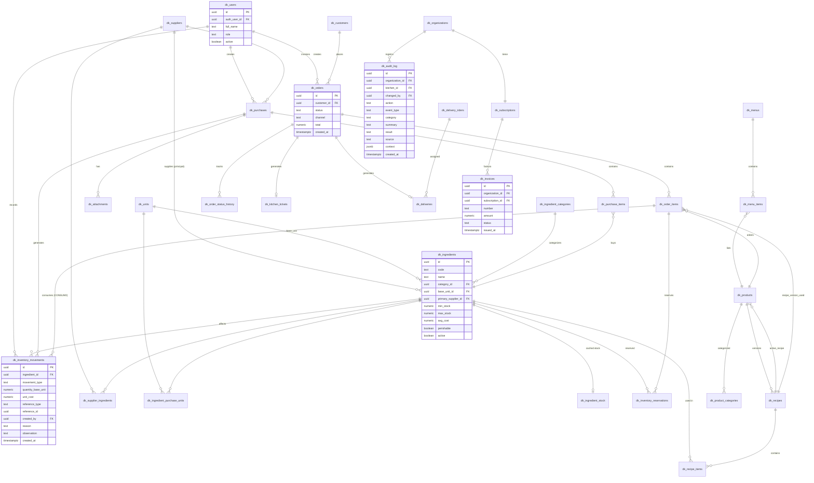

# Database ERD — Quanela (prefijo `dk_`)

## Diagrama (mermaid)


```mermaid
erDiagram
    dk_users ||--o{ dk_purchases : "creates"
    dk_users ||--o{ dk_orders : "creates"
    dk_users ||--o{ dk_inventory_movements : "records"

    dk_suppliers ||--o{ dk_ingredients : "supplies (principal)"
    dk_suppliers ||--o{ dk_purchases : "invoices"
    dk_suppliers ||--o{ dk_supplier_ingredients : ""
    dk_ingredients ||--o{ dk_supplier_ingredients : ""

    dk_units ||--o{ dk_ingredients : "base_unit"
    dk_units ||--o{ dk_ingredient_purchase_units : ""
    dk_ingredients ||--o{ dk_ingredient_purchase_units : ""

    dk_ingredient_categories ||--o{ dk_ingredients : "categorizes"

    dk_ingredients ||--o{ dk_inventory_movements : "affects"
    dk_ingredients ||--o| dk_ingredient_stock : "cached stock"
    dk_ingredients ||--o{ dk_inventory_reservations : "reserved"
    dk_ingredients ||--o{ dk_recipe_items : "used in"

    dk_purchases ||--o{ dk_purchase_items : "contains"
    dk_purchase_items }o--|| dk_ingredients : "buys"
    dk_purchases ||--o{ dk_inventory_movements : "generates"
    dk_purchases ||--o{ dk_attachments : "has"

    dk_recipes ||--o{ dk_recipe_items : "contains"
    dk_products ||--o{ dk_recipes : "versions"
    dk_products }o--|| dk_recipes : "active_recipe"
    dk_products ||--o{ dk_product_categories : "categorized"

    dk_menus ||--o{ dk_menu_items : "contains"
    dk_menu_items }o--|| dk_products : "lists"

    dk_customers ||--o{ dk_orders : "places"
    dk_orders ||--o{ dk_order_items : "contains"
    dk_order_items }o--|| dk_products : "orders"
    dk_order_items }o--|| dk_recipes : "recipe_version_used"
    dk_orders ||--o{ dk_order_status_history : "tracks"
    dk_orders ||--o| dk_kitchen_tickets : "generates"
    dk_orders ||--o| dk_deliveries : "generates"
    dk_delivery_riders ||--o{ dk_deliveries : "assigned"
    dk_order_items ||--o{ dk_inventory_reservations : "reserves"
    dk_order_items ||--o{ dk_inventory_movements : "consumes (CONSUMO)"

    dk_users {
        uuid id PK
        uuid auth_user_id FK
        text full_name
        text role
        boolean active
    }
    dk_ingredients {
        uuid id PK
        text code
        text name
        uuid category_id FK
        uuid base_unit_id FK
        uuid primary_supplier_id FK
        numeric min_stock
        numeric max_stock
        numeric avg_cost
        boolean perishable
        boolean active
    }
    dk_inventory_movements {
        uuid id PK
        uuid ingredient_id FK
        text movement_type
        numeric quantity_base_unit
        numeric unit_cost
        text reference_type
        uuid reference_id
        uuid created_by FK
        text reason
        text observation
        timestamptz created_at
    }
    dk_organizations ||--|| dk_subscriptions : "tiene"
    dk_subscriptions ||--o{ dk_invoices : "factura"
    dk_organizations ||--o{ dk_audit_log : "registra"
    dk_audit_log {
        uuid id PK
        uuid organization_id FK
        uuid kitchen_id FK
        uuid changed_by FK
        text action
        text event_type
        text category
        text summary
        text result
        text source
        jsonb context
        timestamptz created_at
    }
    dk_invoices {
        uuid id PK
        uuid organization_id FK
        uuid subscription_id FK
        text number
        numeric amount
        text status
        timestamptz issued_at
    }
    dk_orders {
        uuid id PK
        uuid customer_id FK
        text status
        text channel
        numeric total
        timestamptz created_at
    }
```

> El diagrama omite algunas columnas por brevedad; el detalle completo de cada tabla está abajo.

---

## Lista completa de tablas

### Identidad / RBAC
- `dk_users` — perfil de staff, 1:1 con `auth.users`; `avatar_key` = uno de los 20 avatares de personas (ADR 0009)
- `dk_audit_log` — **bitácora de solo agregar (append-only, ADR 0012)**:
  - Columnas: `table_name`, `record_id`/`record_key`, `action` (`INSERT`/`UPDATE`/`DELETE`/`EVENT`), `old_data`/`new_data` (en `UPDATE`, solo las columnas que cambiaron), `changed_by`, `organization_id`, `kitchen_id`, `created_at`. Además: `event_type` (`account.created`, `role.assigned`, `plan.changed`, `auth.signed_in`, `ai.run_failed`…), `category`, `summary` (texto legible), `result` (`success`/`failure`), `source` (`db`/`edge`/`app`) y `context` (jsonb).
  - Un disparador `BEFORE INSERT` (`dk_audit_classify`) completa `event_type`, `category` y `summary`.
  - Sin escrituras desde la API. Una guardia bloquea `UPDATE`/`DELETE`/`TRUNCATE` salvo en la retención (`dk_purge_audit_log`, 400 días, `pg_cron`).
  - Índices: `(organization_id, created_at desc)`, `(organization_id, category, created_at desc)`, `(kitchen_id, created_at desc)`, `(kitchen_id, category, created_at desc)` y `(changed_by, created_at desc)`.

### Organizaciones, Cuentas y funciones (ADR 0008 y 0009)
- `dk_organizations` — el negocio; `owner_user_id` = SUPER_ADMIN (creador, intransferible)
- `dk_organization_members` — usuario ↔ organización (SUPER_ADMIN o Miembro; activo/pendiente/desactivado)
- `dk_kitchens` — la **Cuenta** (establecimiento); `icon_key` = uno de los 20 iconos de establecimiento
- `dk_kitchen_members` / `dk_member_roles` — usuario ↔ Cuenta, con varios roles y uno predeterminado
- `dk_roles` / `dk_role_permissions` / `dk_permissions` — RBAC: plantillas, roles propios y catálogo de permisos
- `dk_features` — catálogo de funciones opcionales (IA, voz): permiso para usarla y para activarla, valores por defecto y `settings_schema` (tipo y rango de cada parámetro, validado en la base; ADR 0011)
- `dk_organization_features` — qué funciones ofrece cada organización (sin fila = valor del catálogo)
- `dk_kitchen_features` — qué funciones activa cada Cuenta y sus parámetros (antes `dk_ai_features`; la vista de compatibilidad se retiró en ADR 0011)
- `dk_ai_insights` — análisis de IA (append-only), por Cuenta y función

### IA y voz (ADR 0014)
- `dk_features` — catálogo de funciones (IA y voz):
  - `active` = interruptor global de la plataforma;
  - `model_key` (FK `dk_ai_models`);
  - `min_interval_seconds` (intervalo propio; nulo = el del plan);
  - `depends_on`;
  - `default_settings` y `settings_schema` (tipos number/boolean/string con rangos, `enum` o `ref: voice_profile`).
- `dk_ai_models` — modelos permitidos (`provider`, `label`, precios USD por millón de tokens, solo para estimar; nulos = sin estimación). Solo la plataforma.
- `dk_voice_profiles` — catálogo de voces de cocina (Ivan, Karen, Dago, Daniel, Belen): `gender`, `default_style`, `pitch`, `lang`, `provider = device`, `device_voice_hints`. Lectura: autenticados (solo activas); escritura: plataforma por RPC.
- `dk_organization_features.settings` — valores por defecto de la organización y `allow_account_override`.
- `dk_kitchen_features.settings` — parámetros de la Cuenta. En `voice_speech` guarda la voz de la Cuenta (`profile`, `style`, `rate`, `volume`, `lang`); no hay tabla de voz aparte.
- `dk_ai_insights` — agrega `input_tokens`, `output_tokens` y `latency_ms` (desde el ADR 0014).

### Planes y suscripciones (ADR 0010)
- `dk_plans` — catálogo de planes (precio mensual/anual, prueba, límites `{accounts, users, ai_runs_per_day}`, viñetas, CTA, estado, orden). Lectura pública
- `dk_plan_features` — funciones (`dk_features`) incluidas en cada plan. Lectura pública
- `dk_subscriptions` — **una por organización** (el plan es de la organización, no del usuario): plan, estado (`trialing`/`active`/`past_due`/`canceled`/`expired`), periodicidad, prueba, período, cancelación y `provider_*` (pagos futuros). Lectura con `billing.view` (ADR 0012)
- `dk_invoices` — facturas de la suscripción (ADR 0012; **vacía hasta que haya pagos**): `organization_id`, `subscription_id`, `number` (único por organización), período, `amount`, `currency`, `status` (`draft`/`open`/`paid`/`void`/`uncollectible`), `issued_at`, `due_at`, `paid_at`, `provider`, `provider_invoice_id`, `pdf_url`. Lectura con `billing.view`; sin escrituras desde la API; auditada. Índice `(organization_id, issued_at desc)`

### Catálogos base
- `dk_units` — unidades de medida y su factor de conversión a la unidad base de su tipo
- `dk_ingredient_categories`
- `dk_product_categories`

### Insumos e inventario
- `dk_ingredients`
- `dk_ingredient_purchase_units` — empaques de compra específicos por insumo (caja, bolsa, etc.)
- `dk_ingredient_stock` — **caché** de stock actual/reservado/disponible por insumo (derivable 100% del ledger)
- `dk_inventory_movements` — **ledger**, append-only (COMPRA, MERMA, AJUSTE, CONSUMO, DEVOLUCION)
- `dk_inventory_reservations` — reservas activas ligadas a `order_items`

### Proveedores y compras
- `dk_suppliers`
- `dk_supplier_ingredients` — qué insumos compramos a cada proveedor (+ costo pactado opcional)
- `dk_purchases` — factura de compra (cabecera)
- `dk_purchase_items` — líneas de la factura
- `dk_attachments` — archivos genéricos en Storage (facturas escaneadas, fotos), referenciables desde cualquier entidad (`entity_type` + `entity_id`)

### Recetas y productos
- `dk_recipes` — versionado (`product_id`, `version`, `is_active`)
- `dk_recipe_items` — ingredientes de una versión de receta
- `dk_products` — el plato vendible (referencia `active_recipe_id`)

### Menú
- `dk_menus`
- `dk_menu_items` — disponibilidad/precio especial de un producto dentro de un menú/fecha

### Clientes y pedidos
- `dk_customers`
- `dk_orders`
- `dk_order_items`
- `dk_order_status_history` — auditoría de transición de estados del pedido

### Cocina
- `dk_kitchen_tickets` — comanda (snapshot 1:1 con `dk_orders` al confirmar)

### Despacho / domicilios
- `dk_delivery_riders`
- `dk_deliveries` — 1:1 con `dk_orders`, asignación de domiciliario + timestamps

### Reservado para Fase 9 (no se crea aún)
- `dk_whatsapp_conversations`, `dk_whatsapp_messages` — se diseñan cuando llegue la fase; hoy solo se reservan columnas (`dk_orders.channel`, `dk_orders.external_reference`, `dk_customers.whatsapp_id`).

---

## Enums propuestos

```sql
create type dk_role as enum ('ADMIN','MANAGER','KITCHEN','INVENTORY','CASHIER','DELIVERY');

create type dk_unit_type as enum ('WEIGHT','VOLUME','UNIT');

create type dk_movement_type as enum ('COMPRA','MERMA','AJUSTE','CONSUMO','DEVOLUCION');

create type dk_reservation_status as enum ('ACTIVE','RELEASED','CONSUMED');

create type dk_purchase_status as enum ('BORRADOR','CONFIRMADA','ANULADA');

create type dk_order_status as enum ('NUEVO','CONFIRMADO','EN_PREPARACION','LISTO','DESPACHADO','ENTREGADO','CANCELADO');

create type dk_order_channel as enum ('MANUAL','WHATSAPP','PHONE');

create type dk_kitchen_item_status as enum ('PENDIENTE','EN_PREPARACION','LISTO');

create type dk_delivery_status as enum ('ASIGNADO','EN_RUTA','ENTREGADO','FALLIDO');
```

## Claves, índices y constraints notables

- `dk_inventory_movements`: **sin** política de `UPDATE`/`DELETE` para ningún rol (ni ADMIN) — solo `INSERT`. Índice compuesto `(ingredient_id, created_at)` para reconstrucción/reportes. `quantity_base_unit` puede ser negativo (salida) o positivo (entrada); `movement_type` determina el signo esperado (constraint `CHECK`).
- `dk_ingredient_stock`: `UNIQUE(ingredient_id)`, mantenida solo por trigger (no editable directo por el cliente).
- `dk_recipes`: `UNIQUE(product_id, version)`; solo una fila con `is_active = true` por `product_id` (constraint parcial `UNIQUE(product_id) WHERE is_active`).
- `dk_purchases`: `UNIQUE(supplier_id, invoice_number)` para evitar duplicar una factura.
- `dk_order_items.recipe_id`: al confirmar (`dk_confirm_order`) se congela la receta activa de cada plato con `dk_products.uses_inventory = true`, y ese plato no se confirma sin receta. Los platos con `uses_inventory = false` quedan con `recipe_id` nulo: no reservan ni descuentan insumos (ADR 0048). Se valida en el RPC, no como constraint de columna.
- `dk_products.uses_inventory` / `dk_master_products.uses_inventory`: «Descuenta inventario», `true` por defecto. La copia de un menú maestro lo hereda al sincronizar y la cuenta no lo cambia (ADR 0048).
- `dk_customers.whatsapp_id`: `UNIQUE`, nullable.
- Todas las tablas: `created_at timestamptz default now()`, y donde aplica `updated_at` mantenido por trigger genérico `dk_set_updated_at()`.

## Triggers necesarios

1. `dk_trg_movements_update_stock` — `AFTER INSERT` en `dk_inventory_movements` → recalcula/actualiza `dk_ingredient_stock`.
2. `dk_trg_recipe_cost_recalc` — `AFTER INSERT/UPDATE` en `dk_recipe_items` o cambio de `avg_cost` en `dk_ingredients` → recalcula `dk_products.estimated_cost` de los productos afectados.
3. `dk_trg_set_updated_at` — genérico, en todas las tablas mutables.
4. `dk_audit_row()` — en las tablas auditadas (Cuentas, miembros, roles, funciones, suscripción, facturas, pedidos, compras, catálogo…) → inserta en `dk_audit_log`. Omite las actualizaciones sin cambios y las que solo cambian la "última cuenta" del usuario. Complementos (ADR 0012):
   - `dk_trg_audit_log_classify` (`BEFORE INSERT` en la bitácora);
   - `dk_guard_audit_log` (solo agregar);
   - `dk_trg_ai_insights_audit_failure` (análisis de IA con error → evento `ai.run_failed`).
5. `dk_trg_purchase_confirm_guard` — impide editar líneas de una compra ya `CONFIRMADA`.

## Funciones SQL (RPC) necesarias

- `dk_confirm_purchase(purchase_id)` → genera movimientos `COMPRA`, actualiza costo promedio, cambia estado.
- `dk_confirm_order(order_id)` → valida stock disponible, crea reservas, genera `dk_kitchen_tickets`, cambia estado a `CONFIRMADO`.
- `dk_mark_order_item_ready(order_item_id)` → consume reserva del ítem (movimiento `CONSUMO`), actualiza `kitchen_status`; si todos los ítems quedan listos, transiciona el pedido a `LISTO`.
- `dk_cancel_order(order_id, reason)` → libera reservas activas o genera `DEVOLUCION` si ya hubo consumo.
- `dk_register_waste(ingredient_id, quantity, reason, observation)` → movimiento `MERMA`.
- `dk_register_adjustment(ingredient_id, quantity, observation)` → movimiento `AJUSTE`.
- `dk_calculate_recipe_cost(recipe_id)` → función auxiliar usada por el trigger de costeo y por reportes de rentabilidad.
- **Centro de administración (ADR 0012):**
  - `dk_org_events(org, cuenta, categoría, persona, desde, hasta, texto, cursor, límite)` → bitácora paginada por cursor. Exige `observability.view`.
  - `dk_org_observability(org)` → totales, cuentas, alertas reales y eventos recientes.
  - `dk_account_observability(org, cuenta)` → verifica que la Cuenta sea de la organización.
  - `dk_log_sign_in()` → registra el inicio de sesión, como mucho uno por minuto.
  - `dk_my_subscription(org)` y `dk_org_users(org)` → la primera exige `billing.view`; la segunda agrega incorporación y última actividad.
  - Auxiliares de zona horaria: `dk_kitchen_tz`, `dk_local_start`, `dk_local_date`. `dk_dashboard_summary` y los `dk_report_*` calculan "hoy" en la zona de la Cuenta.
- **IA y voz (ADR 0014):**
  - `dk_platform_ai_overview()`, `dk_platform_set_feature(key, active, model, interval, defaults)`, `dk_platform_set_model(…)`, `dk_platform_set_plan_ai_limits(plan, runs, interval)`, `dk_platform_set_voice_profile(…)` y `dk_platform_ai_usage(days)`: solo plataforma.
  - `dk_set_kitchen_feature` (activación, solo organización o plataforma) y `dk_set_kitchen_feature_settings` (parámetros de la Cuenta).
  - `dk_set_org_feature_settings` (valores y política de la organización).
  - `dk_org_ai_usage(org, days)`.
  - `dk_ai_run_allowed` devuelve además el modelo.
- ~~`dk_current_role()`~~ → retirada en la Fase 6 de multi-cocina. Hoy las políticas usan `dk_current_kitchen_id()` y `dk_can('módulo.acción')` con el rol activo (ver [ADR 0008](./adr/0008-organizaciones-y-cuentas.md)).
